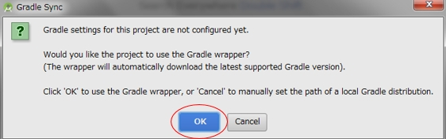
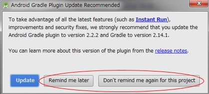
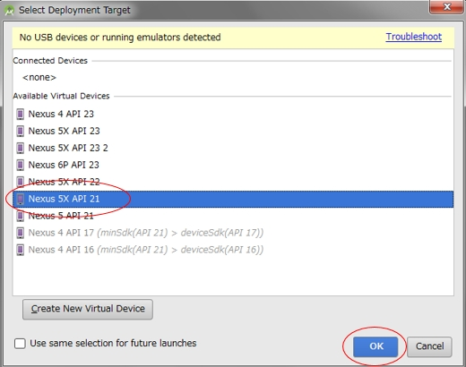

# IBM IoT for Automotive - OBDII Fleet Management App for Android


## Overview
The IBM IoT for Automotive - Mobility Starter Application uses the **IBM IoT Platform** that is available on **IBM Bluemix** to help you to quickly build a smart fleet management solution. The solution consists of a mobile app and a server component which is the **IBM IoT for Automotive - Fleet Management Starter Web Application**.

### Mobile app
The starter app provides a mobile app to connect to an OBDII dongle plugged in to your car. If you are a user of the application, you can use the mobile app to do the following tasks:

- See real-time data from your car on the screen
- Beam the data to the IBM IoT Platform, which will automatically get synced to the **Fleet Management Web Application**

While you drive the car, the service tracks your location and also records the health of your car. This will happen in the background, which means you could lock your phone in the meantime or use other applications.

Once you want to stop the application from recording your data, simply press "End Session", and the application will close.

You can currently download and install the mobile app on your Android mobile device.

### Server component
The "IoT for Automotive - OBDII Fleet Management App" interacts with a server component. The server component provides the back-end fleet management and system monitoring service that provides more features for fleet management companies. By default, the mobile app connects to a test server that is provided by IBM. You can also choose to deploy your own server instance to IBM Bluemix and connect your mobile app to that instance instead of the test system. For more information about deploying the fleet management server component, see [ibm-watson-iot/iota-starter-server-fm](https://github.com/ibm-watson-iot/iota-starter-server-fm).


## Prerequisites

Before you deploy the Android application, ensure that the following prerequisites are met:

- Install the Android Studio integrated development environment (IDE) V2.1.1 or later.
- Install an Android emulator device that is running on at least API Level 21.
- The sample source code for the mobile app is supported only for use with an Android device and is intended to be used in conjunction with officially licensed Android development tools and further customized tools that are distributed under the terms and conditions of your licensed Android Developer Program.


## Deploying the mobile app

To try the Android application using Android Emulator, complete the following steps:

1. Clone the source code repository for the mobile app by using the following git command:    

    ```$ git clone https://github.com/ibm-watson-iot/iota-starter-obd-android```  

2. Open the project in Android Studio.

    If you encounter the following dialog, press 'OK'.    
     
        
     
    If you encounter the following dialog, do NOT 'Update'.    
 
        

3. Edit the **iota-starter-obd-android/app/java/obdii.starter.automotive.iot.ibm.com.iot4a_obdii/IoTPlatformDevice.java** file, and set the `defaultOrganizationId` variable to your Organization's ID, and the `defaultApiKey` and `defaultApiToken` variables to your API key and Auth Token, respectively, from your instance of the IoT Platform.

4. In Android Studio, run the application by pressing **Run 'app'**.

    If you use a virtual device, make sure that you use one with API level 21 as seen in the following dialog.

    

5. To deploy the mobile app on your device, see [Build and Run Your App](https://developer.android.com/studio/run/index.html).

## Reporting defects
To report a defect with the IoT for Automotive - Mobility Starter Application mobile app, go to the [Issues](https://github.com/ibm-watson-iot/iota-starter-obd-android/issues) section.

## Privacy notice
The "IoT for Automotive - OBDII Fleet Management App for Android" on Bluemix stores all of the driving data that is obtained while you use the mobile app.

## Questions, comments or suggestions
For your questions, comments or suggestions to us, visit [Watson IoT for Automotive Application community site] (https://www.ibm.com/developerworks/community/groups/service/html/communitystart?communityUuid=3b06ca1c-fd7c-4a59-a888-e5e3a8384091).

## Useful links

- [IBM IoT for Automotive](http://www.ibm.com/internet-of-things/iot-industry/iot-automotive)
- [IBM Watson Internet of Things](http://www.ibm.com/internet-of-things/)  
- [IBM Watson IoT Platform](http://www.ibm.com/internet-of-things/iot-solutions/watson-iot-platform/)   
- [IBM Watson IoT Platform Developers Community](https://developer.ibm.com/iotplatform/)
- [IBM Bluemix](https://bluemix.net/)  
- [IBM Bluemix documentation](https://www.ng.bluemix.net/docs/)  
- [IBM Bluemix developers community](http://developer.ibm.com/bluemix) 
